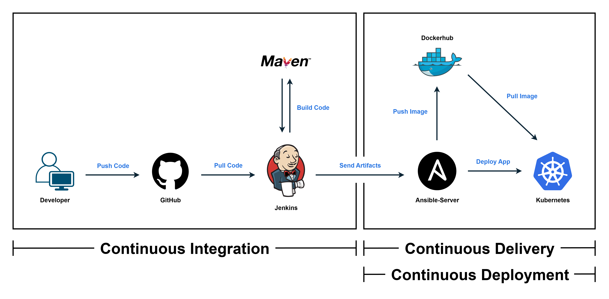
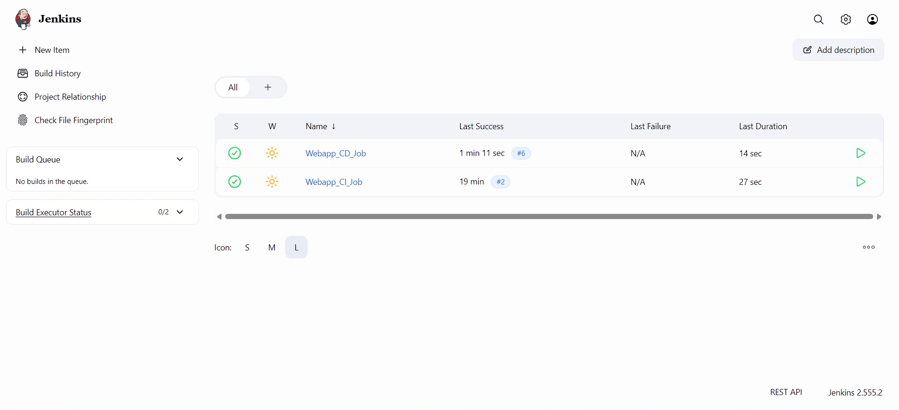
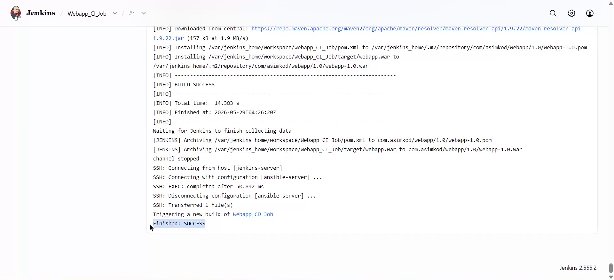
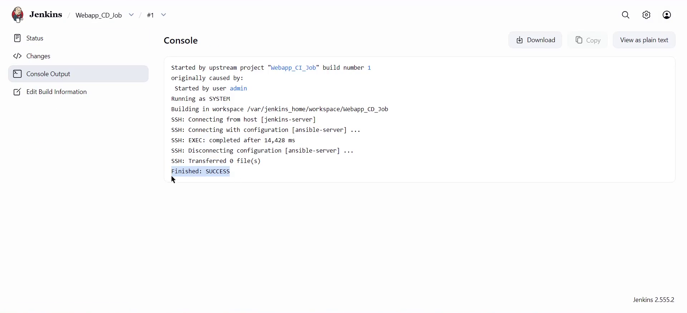
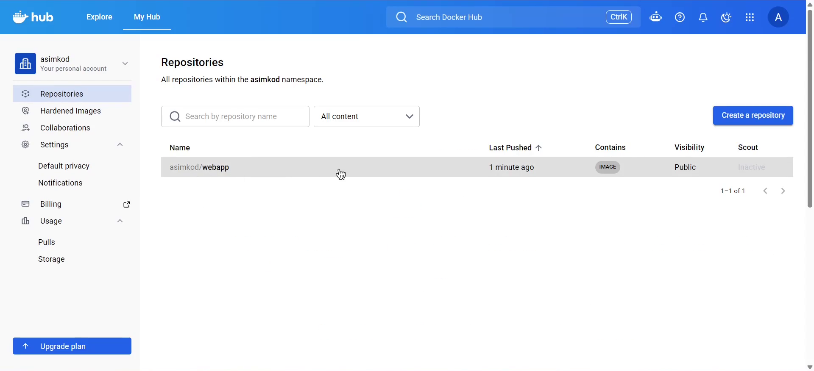
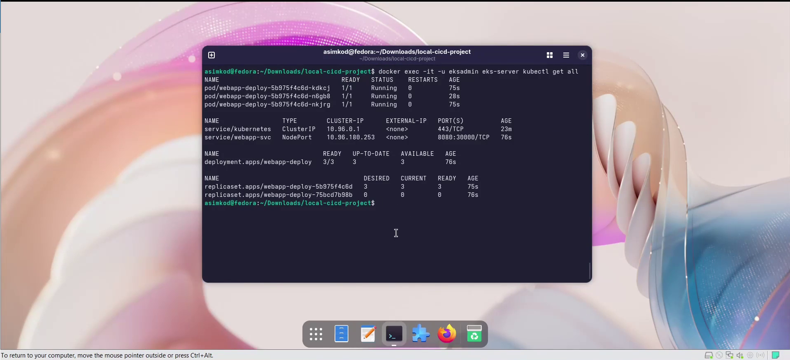
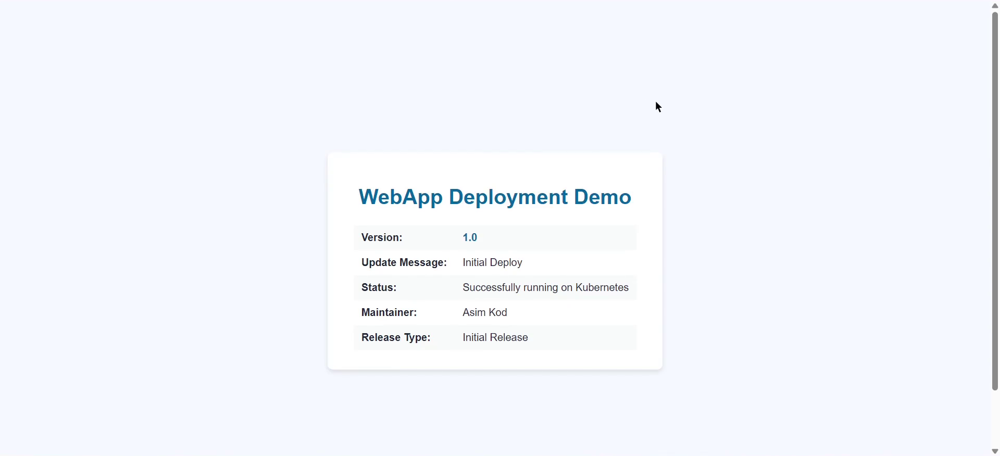

# 🚀 CI/CD Pipeline With Docker — Java Application Deployment

> A fully automated local CI/CD pipeline for a Java application using Jenkins, Maven, Ansible, Docker, DockerHub, and Kubernetes (KIND).

## 🏗️ Architecture Flow  
<p>
   
</p>

## 📌 Project Overview

This project demonstrates an end-to-end **CI/CD pipeline for a Java-based application**, recreated locally using **Docker Compose**.

The project replicates the core CI/CD workflow of a cloud-based deployment environment while running the required infrastructure as isolated Docker containers on a local machine.

The pipeline covers the complete workflow from source code retrieval and application build to Docker image creation, image publishing, and automated Kubernetes deployment.

The system is divided into two major stages: **Continuous Integration (CI)** and **Continuous Delivery (CD)**.

## 🔧 Continuous Integration (CI)

- The developer pushes application code to **GitHub**.
- The **Jenkins CI job** is triggered manually for local testing.
- Jenkins pulls the source code and uses **Maven** to build the Java application.
- The generated application artifact is transferred to the **Ansible container**.
- Ansible triggers the Docker image build process.
- The Docker image is pushed to **DockerHub**.

**Goal:** Build → Docker Image → Push to DockerHub (Fully Automated)

## 🚀 Continuous Delivery/Deployment (CD)

- Once the CI job completes successfully, Jenkins automatically triggers the **CD job**.
- The CD workflow invokes **Ansible** to connect to the local KIND Kubernetes cluster.
- Ansible uses `kubectl` to apply the existing Kubernetes deployment configuration.
- Kubernetes performs a **rolling update** of the application pods.
- The updated application becomes available through the configured port-forwarding mechanism.

**Goal:** DockerHub → Kubernetes Deployment (Automated Delivery)

## 🐳 Docker Compose Infrastructure

The complete local environment is orchestrated using a single `docker-compose.yml` file.

The environment consists of isolated containers that simulate the different infrastructure components required by the CI/CD pipeline:

- **Jenkins** — CI/CD orchestration
- **Ansible** — Configuration and deployment automation
- **KIND** — Local Kubernetes cluster
- **Docker-in-Docker (DinD)** — Docker image build environment

This approach makes it possible to reproduce the complete workflow without requiring separate physical or cloud servers for each component.

## 🔄 CI/CD Workflow

### CI Phase

```text
GitHub
   ↓
Jenkins
   ↓
Maven Build
   ↓
Application Artifact
   ↓
Ansible
   ↓
Docker Image Build
   ↓
DockerHub
```

### CD Phase

```text
Jenkins
   ↓
CD Job
   ↓
Ansible
   ↓
KIND Kubernetes Cluster
   ↓
Rolling Update
   ↓
Updated Application
```

## 🛠️ Key Engineering Implementations

### Docker-in-Docker

Docker-in-Docker is configured inside the Ansible container to allow the CI/CD workflow to build Docker images from within the containerized environment.

The **VFS storage driver** is used for the nested Docker environment.

### Persistent Infrastructure State

Docker named volumes are used to persist important configuration and application state across container restarts.

This includes:

- Jenkins configuration and jobs
- Ansible configuration
- KIND/Kubernetes-related state
- Other required persistent data

### Persistent Kubernetes Port Forwarding

The application is exposed to the local host using `kubectl port-forward`.

Since Kubernetes pods can be recreated during a rolling update, the original port-forward process can terminate.

To handle this, a custom shell wrapper is used to automatically maintain the port-forwarding process and keep the application accessible from the host machine.

Example:

```text
http://localhost:8085/webapp
```

### Process & Socket Management

During development and troubleshooting, several infrastructure-level issues were handled using Linux utilities and process management techniques.

Examples include:

- `nohup` — keeping background processes running independently
- `fuser` — identifying and releasing processes occupying required sockets/ports

## 🏗️ CICD In Action

<table>
  <tr>
    <td align="center">
      <br>
      <b>All Jenkins Jobs</b>
    </td>
    <td align="center">
      <br>
      <b>CI Job</b>
    </td>
  </tr>

  <tr>
    <td align="center">
      <br>
      <b>CD Job</b>
    </td>
    <td align="center">
      <br>
      <b>DockerHub Image</b>
    </td>
  </tr>

  <tr>
    <td align="center">
      <br>
      <b>Application on Kubernetes</b>
    </td>
    <td align="center">
      <br>
      <b>Web Application</b>
    </td>
  </tr>
</table>

## 🎯 Key Highlights

- Fully automated local CI/CD pipeline
- Jenkins, Maven, Ansible, Docker, DockerHub, and Kubernetes working together
- Complete infrastructure orchestrated using **Docker Compose**
- Local Kubernetes deployment using **KIND**
- Docker-in-Docker implementation for image creation
- Persistent Jenkins and infrastructure configuration using Docker volumes
- Automated Kubernetes rolling updates
- Persistent `kubectl port-forward` handling
- Practical troubleshooting of processes, ports, containers, and Kubernetes workloads
- Cloud-inspired CI/CD workflow reproduced in a local environment
- Designed for learning, experimentation, development, and CI/CD workflow validation
